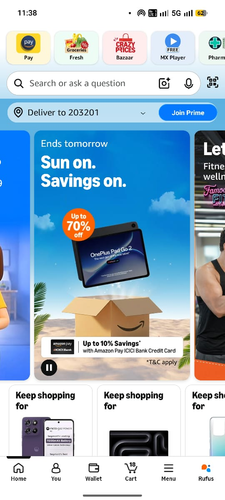
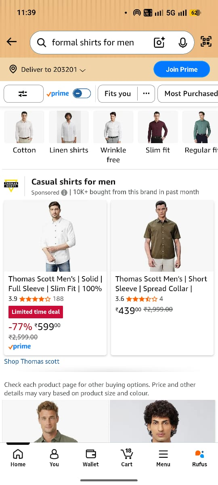

# UI & Usability Testing Project

## 📌 Project Overview
This project focuses on evaluating the user interface and usability of an e-commerce website.

## 🎯 Objective
To analyze user experience and identify usability issues in the application.

## ✅ Features Tested
- Search functionality
- Add to cart feature
- Navigation menu
- Product details view

## 🧪 Testing Types
- UI Testing
- Usability Testing

## 📂 Project Files
- TestCases.txt
- UsabilityReport.txt

## 📸 Screenshots
- Home Page
- Product Page

## 🛠 Tools Used
- Manual Testing

## 🚀 Author
Anurag Kushwaha

## 📸 Screenshots

### Home Page

### Product Page

